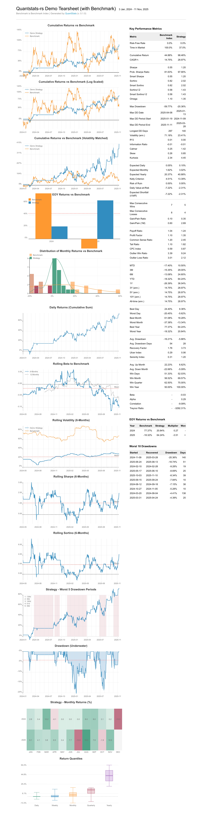

# quantstats-rs

Rust 版本的 [QuantStats](https://github.com/ranaroussi/quantstats) 风格绩效报表库，用于从收益率时间序列生成 HTML tear sheet。
本仓库以 Python QuantStats的实现和输出为对照，尽量在数值和图表上做到一一对应。

基准 Tearsheet 预览：



## 功能概览

- 从单条策略或“策略 + 基准”收益序列生成完整 HTML 报告：
  - 指标表：CAGR、Sharpe / Sortino、回撤、Calmar、Gain-to-Pain 等（见 `PerformanceMetrics`）。
  - 图表：
    - Cumulative Returns / Cumulative Returns vs Benchmark（含对数与波动率匹配版本）
    - Daily Returns (Cumulative Sum)
    - Rolling Vol / Sharpe / Sortino / Beta
    - Drawdown (Underwater)（含平均回撤红色虚线、0% 以下填充区域）
    - Strategy – Worst 5 Drawdown Periods
    - EOY Returns / EOY Returns vs Benchmark（含红色虚线均值）
    - Monthly Returns Heatmap
    - Returns Distribution / Monthly Distribution
- 图表风格尽量复刻 Python QuantStats：
  - 同样的颜色方案（策略 `#348dc1`，基准 `#ff9933` 等）
  - 等比背景网格、纵轴数值、底部时间轴
  - 虚线零线 / 均值线、填充区域（如 Underwater Plot）

## 仓库结构

- `src/`
  - `lib.rs`：对外公开 API（`html`, `HtmlReportOptions`, `ReturnSeries`, `PerformanceMetrics`）。
  - `reports.rs`：HTML 报表拼装与指标表渲染。
  - `stats.rs`：各类绩效指标与回撤段计算。
  - `plots.rs`：所有 SVG 图表生成逻辑。
  - `report_template.html`：HTML 模板，对齐 Python QuantStats 的 `report.html`。
- `examples/`
  - `html_report.rs`：仅策略，输出 `tearsheet.html`。
  - `html_with_benchmark.rs`：策略 + 基准，输出 `tearsheet_with_benchmark.html`。
  - `common.rs`：由 `data` 下样例数据通过脚本自动生成。
- `data/`：示例用价格 / 收益数据。
- `scripts/gen_examples_common.py`：从 `data` 生成 `examples/common.rs`。

## 构建与运行

在仓库根目录：

```bash
cargo build

# 生成仅策略的报告（写入 `tearsheet.html`）
cargo run --example html_report

# 生成“策略 + 基准”的报告（写入 `tearsheet_with_benchmark.html`）
cargo run --example html_with_benchmark

# 运行测试（如有）
cargo test
```

生成的 HTML 可以直接用浏览器打开，与 Python 版 QuantStats 输出进行肉眼对比。

## 作为库使用

在你的项目 `Cargo.toml` 中通过 path 引用本 crate（根据实际路径调整）：

```toml
[dependencies]
quantstats-rs = { path = "../quantstats-rs" }
```

在代码中：

```rust
use chrono::NaiveDate;
use quantstats_rs::{ReturnSeries, HtmlReportOptions, html};

fn main() -> Result<(), Box<dyn std::error::Error>> {
    // 1. 准备日期与收益率（例如日度收益）
    let dates: Vec<NaiveDate> = /* ... */;
    let values: Vec<f64> = /* ... */; // 如 0.01 表示 +1%

    let strategy = ReturnSeries::new(dates, values, Some("Strategy".to_string()))?;

    // 2. 配置报告选项
    let options = HtmlReportOptions::default()
        .with_title("My Strategy Tearsheet")
        .with_strategy_title("My Strategy")
        .with_output("tearsheet.html");

    // 3. 生成 HTML 字符串并写入文件（若配置了 output，内部会自动写盘）
    let html_string = html(&strategy, options)?;

    println!("Report generated ({} bytes)", html_string.len());
    Ok(())
}
```

若需要基准，只需额外构造一个 `ReturnSeries`，然后使用：

```rust
let options = HtmlReportOptions::default()
    .with_benchmark(&benchmark)
    .with_title("Strategy vs Benchmark")
    .with_strategy_title("Strategy")
    .with_benchmark_title("Benchmark")
    .with_output("tearsheet_with_benchmark.html");
```

## 示例数据与再生成

示例程序使用的 `examples/common.rs` 是从 `data` 目录下的数据脚本生成的：

```bash
python3 scripts/gen_examples_common.py
```

修改 `data` 中的数据后，重新运行上述脚本即可更新 `examples/common.rs`，然后再运行示例重新生成 HTML 报告。

## 对齐 Python QuantStats 的细节

本实现以 Python QuantStats 的输出与 vendored Python 代码为基准，对齐了包括但不限于：

- Rolling Vol / Sharpe / Sortino / Beta 的坐标轴、网格与线型（均值红虚线、x 轴虚线等）。
- Underwater Plot 的填充区域与平均回撤红虚线。
- Strategy – Worst 5 Drawdown Periods 的纵轴、网格和标注位置。
- EOY Returns vs Benchmark 的红色虚线均值线。
- 时间轴标签的去重与防重叠逻辑（例如避免 `2025-10`、`2025-11` 文本互相覆盖）。

如在对比 Python 生成的 HTML 时发现任何不一致，欢迎直接在对应图表标题处指出（例如 “Rolling Sortino”、“Underwater Plot”），并附上你看到的差异说明。
